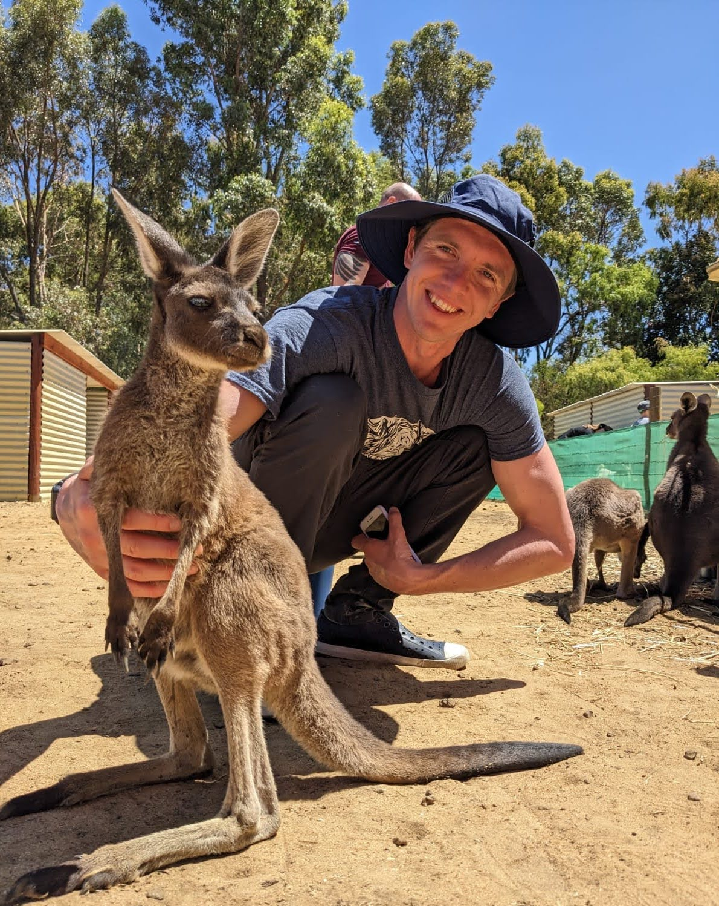

I am a second year PhD student under professor Kwang Moo Yi at the University of British Columbia. 

[Google Scholar](https://scholar.google.ca/citations?hl=en&user=x6t__GoAAAAJ)

[Wikipedia](https://en.wikipedia.org/wiki/Eric_Hedlin)

## Publications

| Date | Paper | Code | Project Page |
| ---- | ----- | ---- | ------------ |
| May 2023 | [Unsupervised Semantic Correspondence Using Stable Diffusion](https://arxiv.org/abs/2305.15581) |  |  |
| March 2023 | [CN-DHF: Compact Neural Double Height-Field Representations of 3D Shapes](https://arxiv.org/abs/2304.13141) | *(coming soon!)* | - |
| May 2022 | [A Simple Method to Boost Human Pose Estimation Accuracy by Correcting the Joint Regressor for the Human3.6m Dataset](https://arxiv.org/abs/2205.00076) |  | - |

  

