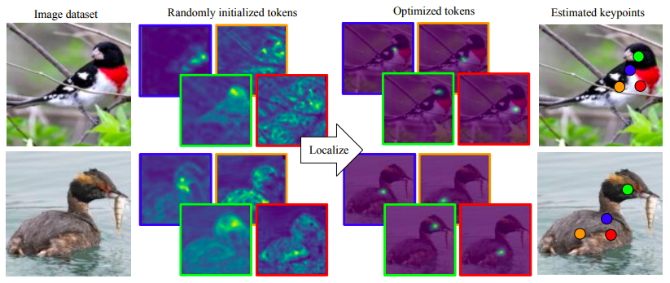
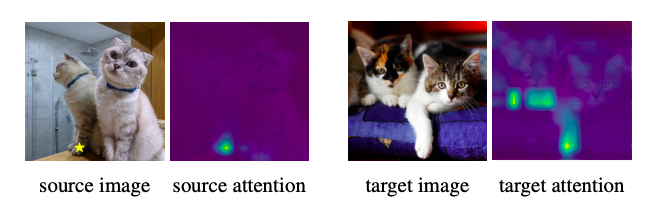
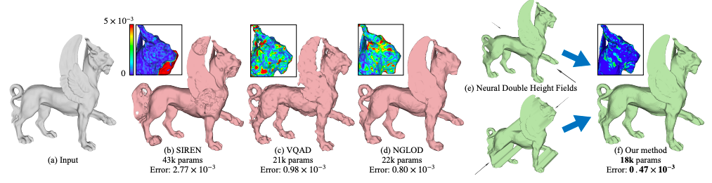
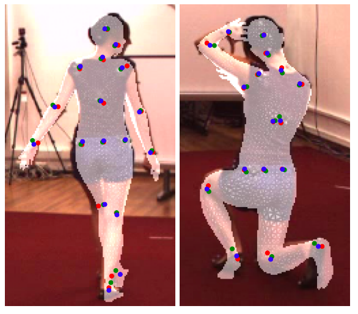

<table class="spaced-table">
  <tr>
    <td style="width: 300px;">
      
    </td>
    <td style="vertical-align: left; min-height: 200px;">
      <!-- Description and Links -->
      Eric Hedlin 
      I am a third-year Ph.D. student under Professor Kwang Moo Yi at the University of British Columbia 
      <a href="https://scholar.google.ca/citations?hl=en&user=x6t__GoAAAAJ">Google Scholar</a> | <a href="https://en.wikipedia.org/wiki/Eric_Hedlin">Wikipedia</a>
    </td>
  </tr>
</table>

## Publications

<table class="spaced-table">
  <tr>
    <td style="width: 400px; text-align: center; vertical-align: middle;">
      
    </td>
    <td style="vertical-align: top; min-height: 400px;">
      <!-- Description and Links -->
      <a href="https://stablekeypoints.github.io"><strong>Unsupervised Keypoints from Pretrained Diffusion Models</strong></a> 
      <strong>Eric Hedlin</strong>, Gopal Sharma, Shweta Mahajan, Xingzhe He, Hossam Isack, Abhishek Kar Helge Rhodin, Andrea Tagliasacchi, Kwang Moo Yi 
      November 2023 
      <a href="https://arxiv.org/abs/2305.15581">Paper</a> | <a href="https://github.com/ubc-vision/LDM_correspondences">Code</a> | <a href="https://stablekeypoints.github.io">Project page</a>
    </td>
  </tr>

  <tr>
    <td style="width: 400px; text-align: center; vertical-align: middle;">
      
    </td>
    <td style="vertical-align: top; min-height: 400px;">
      <!-- Description and Links -->
      <a href="https://ubc-vision.github.io/LDM_correspondences/"><strong>Unsupervised Semantic Correspondence Using Stable Diffusion</strong></a> 
      <strong>Eric Hedlin</strong>, Gopal Sharma, Shweta Mahajan, Hossam Isack, Abhishek Kar, Andrea Tagliasacchi, Kwang Moo Yi 
      May 2023 
      <a href="https://arxiv.org/abs/2305.15581">Paper</a> | <a href="https://github.com/ubc-vision/LDM_correspondences">Code</a> | <a href="https://ubc-vision.github.io/LDM_correspondences/">Project page</a>
    </td>
  </tr>

  <tr>
    <td style="width: 400px; text-align: center; vertical-align: middle;">
      
    </td>
    <td style="vertical-align: top; min-height: 400px;">
      <!-- Description and Links -->
      <a href="https://arxiv.org/abs/2304.13141"><strong>CN-DHF: Compact Neural Double Height-Field Representations of 3D Shapes</strong></a> 
      <strong>Eric Hedlin</strong>, Jinfan Yang, Nicholas Vining, Kwang Moo Yi, Alla Sheffer 
      March 2023 
      <a href="https://arxiv.org/abs/2304.13141">Paper</a> 
    </td>
  </tr>

  <tr>
    <td style="width: 200px; text-align: center; vertical-align: middle;">
      
    </td>
    <td style="vertical-align: top; min-height: 400px;">
      <!-- Description and Links -->
      <a href="https://arxiv.org/abs/2205.00076"><strong>Unsupervised Semantic Correspondence Using Stable Diffusion</strong></a> 
      <strong>Eric Hedlin</strong>, Helge Rhodin, Kwang Moo Yi 
      May 2022 
      <a href="https://arxiv.org/abs/2205.00076">Paper</a> | <a href="https://github.com/ubc-vision/joint-regressor-refinement">Code</a>
    </td>

  </tr>

</table>
